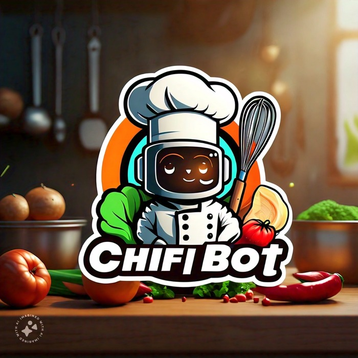

# chefGPT

## FYI 
A lot of code is borrowed from https://github.com/karpathy/nanoGPT
## Motivation behind this project
Everyday I use to spend a lot of time thinking about what should I make for dinner with avaliable ingridents. So I thought why not just train a GPT for suggesting me recipies.😝😝 Just joking!!

## install

```
pip install torch numpy transformers datasets tiktoken wandb tqdm
```

Dependencies:

- [pytorch](https://pytorch.org) <3
- [numpy](https://numpy.org/install/) <3
-  `transformers` for huggingface transformers <3 (to load GPT-2 checkpoints)
-  `datasets` for huggingface datasets <3 (if you want to download + preprocess OpenWebText)
-  `tiktoken` for OpenAI's fast BPE code <3
-  `wandb` for optional logging <3
-  `tqdm` for progress bars <3

## quick start

Manually download data fom this site and move it to food directory.[Download](https://recipenlg.cs.put.poznan.pl/dataset)

**Prepare dataset for fine tuning GPT2**

```
$ python data/food/prepare.py
```
This creates a train.bin and val.bin in that data directory. Now it is time to train your GPT. The size of it very much depends on the computational resources of your system:

**Now lets train GPT2**

```
$ python train.py
```
Adjust the configs as per GPU avaliable at your disposal


You have your personal chef read
```
$ python sample.py
```

## TODO
- [x] From strach write GPT and train it.
- [x] Implement Flash attention.
- [ ] Implement KV cache Pagged attention.
- [ ] Convert the model to run on mobile device.
- [ ] Make it multimodal so I don't have to type ingridents everytime.


